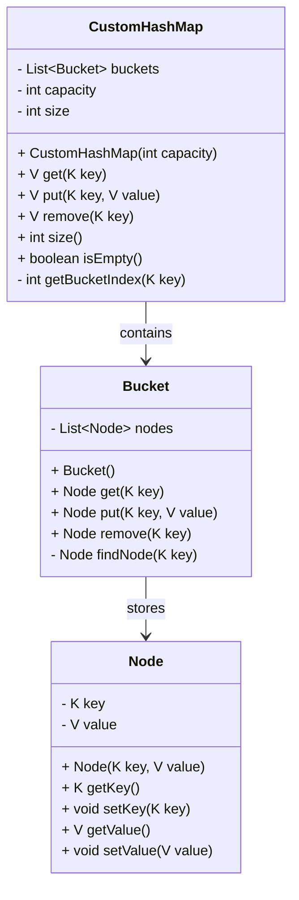

```mermaid
classDiagram  
    class CustomHashMap {  
        - List~Bucket<K, V>~ buckets  
        - int capacity  
        - int size  
        + CustomHashMap(int capacity)  
        + V get(K key)  
        + V put(K key, V value)  
        + V remove(K key)  
        + int size()  
        + boolean isEmpty()  
        - int getBucketIndex(K key)  
    }  
  
    class Bucket {  
        - List~Node<K, V>~ nodes  
        + Bucket()  
        + Node<K, V> get(K key)  
        + Node<K, V> put(K key, V value)  
        + Node<K, V> remove(K key)  
        - Node<K, V> findNode(K key)  
    }  
  
    class Node {  
        - K key  
        - V value  
        + Node(K key, V value)  
        + K getKey()  
        + void setKey(K key)  
        + V getValue()  
        + void setValue(V value)  
    }  
  
    CustomHashMap --> Bucket : contains  
    Bucket --> Node : stores
```
